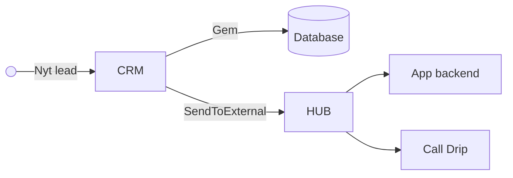
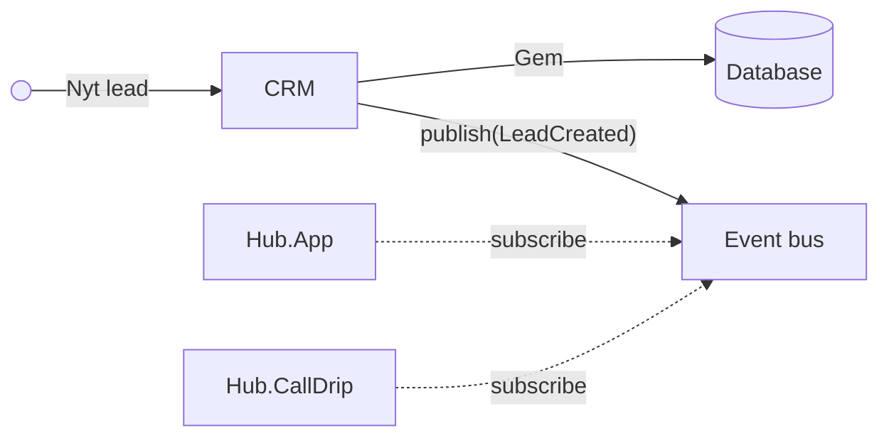
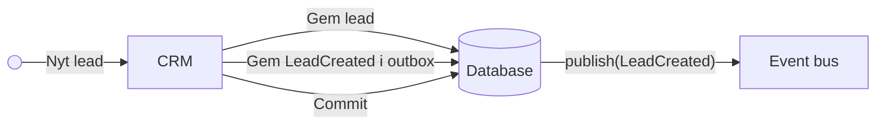

# Events
> Løst koblede systemer

---

## Use Case

- Vi har modtaget et lead <!-- .element: class="fragment" -->
- Der skal sendes en notifikation til sælgeren (app/sms/whatever) <!-- .element: class="fragment" -->
- Skal sendes til 3. part (Call Drip) <!-- .element: class="fragment" -->

----

## Udgangspunkt



- Når Hub'en er nede, bliver leadet aldrig sendt til app og Call Drip <!-- .element: class="fragment" -->
- Når app backenden er nede, sendes (måske) ikke til Call Drip <!-- .element: class="fragment" -->

---

### Intro Event Bus



- Hvad hvis publish fejler? <!-- .element: class="fragment" -->
- Hvad hvis subscriber fejler? <!-- .element: class="fragment" -->
- To af udfordringerne ved distribuerede transaktioner <!-- .element: class="fragment" -->

----

#### Intro Event Bus
### Hvis publish fejler



> Outbox Pattern  
> [...] the service that sends the message to first store the message in the database as part of the transaction [...].  
> -- [microservices.io](https://microservices.io/patterns/data/transactional-outbox.html)
<!-- .element: class="fragment" -->

----

#### Introducing Event Bus
### Hvis subscriber fejler

- Inbox pattern <!-- .element: class="fragment" -->
  - Hjælper ikke for tredjepart <!-- .element: class="fragment" -->
- Idempotente operationer <!-- .element: class="fragment" -->
  - Naturlige <!-- .element: class="fragment" -->
  - Tekniske <!-- .element: class="fragment" -->
- Leasing <!-- .element: class="fragment" -->
  - AKA peek lock <!-- .element: class="fragment" -->


----

## Teoretiske byggesten

- Event bus <!-- .element: class="fragment" -->
- Subscriptions <!-- .element: class="fragment" -->
- Outbox og inbox <!-- .element: class="fragment" -->
- Leasing <!-- .element: class="fragment" -->

---

## Praktiske byggesten

- Azure Service Bus <!-- .element: class="fragment" -->
  - Topics <!-- .element: class="fragment" -->
  - Subscriptions <!-- .element: class="fragment" -->
  - Peek lock <!-- .element: class="fragment" -->
- Wolverine <!-- .element: class="fragment" -->
  - Handlers <!-- .element: class="fragment" -->
  - Inbox/outbox <!-- .element: class="fragment" -->

---

## Azure Service Bus

> Azure Service Bus is a fully managed enterprise message broker with message queues and __publish-subscribe topics__. Use Service Bus to decouple applications and services from each other  
> -- [learn.microsoft.com](https://learn.microsoft.com/en-us/azure/service-bus-messaging/service-bus-messaging-overview)

- Kan også bruges til andet end events (f.eks. commands og queries) <!-- .element: class="fragment" -->
----

## Azure Service Bus

- Service Bus Namespace <!-- .element: class="fragment" -->
  - Ét pr produkt pr miljø <!-- .element: class="fragment" -->
- Queues <!-- .element: class="fragment" -->
  - Input til applikation <!-- .element: class="fragment" -->
  - Mange til en <!-- .element: class="fragment" -->
- Topics + Subscriptions <!-- .element: class="fragment" -->
  - Outputs fra applikation <!-- .element: class="fragment" -->
  - En til mange (fanout) <!-- .element: class="fragment" -->
  - Subscription er effektivt set en queue <!-- .element: class="fragment" -->
- Events <!-- .element: class="fragment" -->
  - En json besked med en type og noget metadata <!-- .element: class="fragment" -->

Lad os kigge nærmere [autodesktop-prod.servicebus.windows.net](https://portal.azure.com/#@autoitazure.onmicrosoft.com/resource/subscriptions/7fcbe3c2-3b61-4149-baad-89083aa17e2f/resourceGroups/RG-SERVICEBUS-PROD/providers/Microsoft.ServiceBus/namespaces/autodesktop-prod/overview)
<!-- .element: class="fragment" -->

----

### Azure Service Bus
## Detaljer

- Adgang via <!-- .element: class="fragment" -->
  - Azure Arc <!-- .element: class="fragment" -->
  - App registration <!-- .element: class="fragment" -->
  - Shared Access Policy <!-- .element: class="fragment" -->
- Opsætning <!-- .element: class="fragment" -->
  - Manuelt <!-- .element: class="fragment" -->
  - Kode <!-- .element: class="fragment" -->

---

## Wolverine
> #### Build Robust Event Driven Architectures with Simpler Code  
> The messaging and web development framework that gets out of your way
<!-- .element: class="fragment" -->

Har fået ret meget tracktion efter MassTransit blev kommercielt <!-- .element: class="fragment" -->

----

## Wolverine

- Understøtter flere transports <!-- .element: class="fragment" -->
  - RabbitMQ <!-- .element: class="fragment" -->
  - Azure Service Bus <!-- .element: class="fragment" -->
  - Local Queue (in memory) <!-- .element: class="fragment" -->
  - AWS <!-- .element: class="fragment" -->
  - ... <!-- .element: class="fragment" -->
- Inbox + outbox <!-- .element: class="fragment" -->
  - SQL Server <!-- .element: class="fragment" -->
  - ... <!-- .element: class="fragment" -->
- Entity Framework intregration <!-- .element: class="fragment" -->
- Meget opinionated <!-- .element: class="fragment" -->

----

## Wolverine
### Publishing

```c#
services.AddWolverine(opt => {
    opt.PublishAllMessages().ToAzureServiceBusTopic("<TOPIC>");
    opt.PersistMessagesWithSqlServer("<CONNECTION_STRING>");
});

public class MyService(IMessageContext ctx) {
    public async Task DoSomething() {
        await ctx.PublishAsync(new SomethingHappened());
    }
}
```
<!-- .element: class="fragment" -->

----

## Wolverine
### Subscriptions

```c#
services.AddWolverine(opt => {
    opt
        .ListenToAzureServiceBusSubscription("<SUBSCRIPTION>")
        .FromTopic("<TOPIC>");
});

public class MyHandler {
    public async Task HandleAsync(SomethingHappened @event) {
        // Do something
    }
}
```
<!-- .element: class="fragment" -->

----

## Wolverine
### Gotchas

- Naming conventions <!-- .element: class="fragment" -->
  - Klassen skal suffixes med Handler eller Consumer <!-- .element: class="fragment" -->
  - Metoden skal hedden Handle eller Consume <!-- .element: class="fragment" -->
    - Evt suffixet med Async <!-- .element: class="fragment" -->
- Wolverine styrer transaktionen (inbox/outbox) <!-- .element: class="fragment" -->
  - Man skal ikke kalde DbContext.SaveChanges <!-- .element: class="fragment" -->
- Wolverine laver et assembly scan ved start <!-- .element: class="fragment" -->
  - Kan gå ud over test performance <!-- .element: class="fragment" -->
- Wovlerine genererer kode runtime <!-- .element: class="fragment" -->
  - Sværere at debugge <!-- .element: class="fragment" -->
- IIS'en lukker som standard efter 20 minutters inaktivitet <!-- .element: class="fragment" -->
  - Ikke et Wolverine problem <!-- .element: class="fragment" -->

Er Wolverine kommet for blive? Måske <!-- .element: class="fragment" -->

---

# 🙋🙋🙋
# Spørgsmål?
## 🙋🙋🙋
