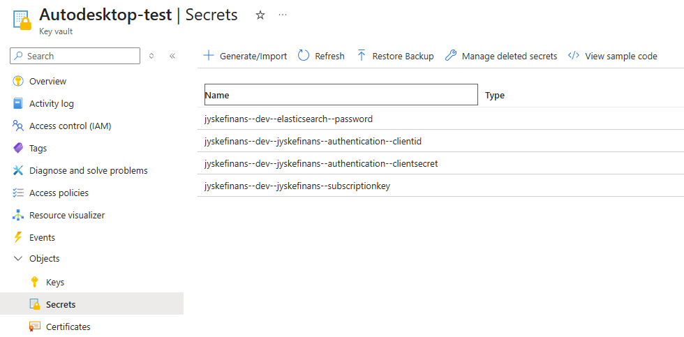
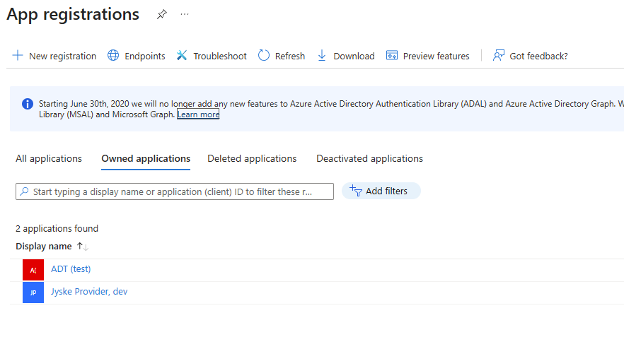
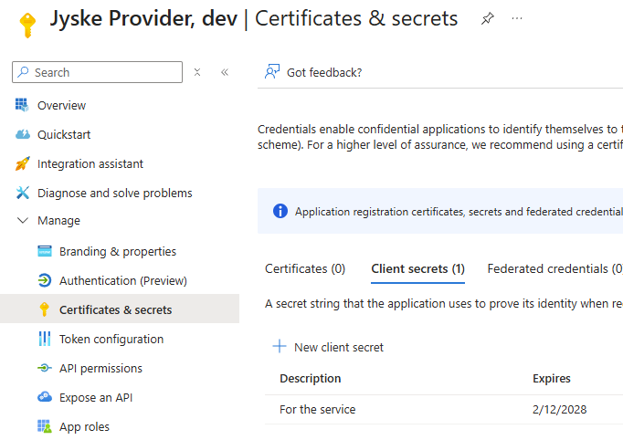
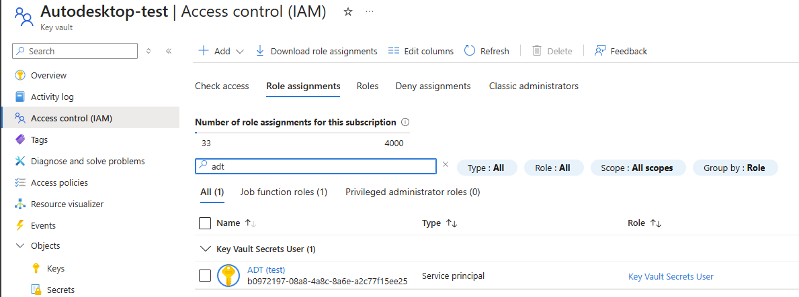

# Key Vault

> Secrets bør ikke være tilgængelige for alle
<!-- .element: class="fragment  " -->
---

## Use case

- Vi er ved at bygge en integration med Jyske Finans
- Vi har en api key til deres api'er
- Hvor gemmer vi denne key?
  1. appsettings.json
<!-- .element: class="fragment  " -->
  2. git secrets
<!-- .element: class="fragment  " -->
  3. key vault
<!-- .element: class="fragment  " -->

---

## Azure Key Vault


- -- tolker configration manageren som nesting. Kan konfigureres
- En vault pr applikation pr miljø
---

## Program.cs

```c#
#:package Azure.Extensions.AspNetCore.Configuration.Secrets

var builder = WebApplication.CreateBuilder(args);

builder.Configuration.AddAzureKeyVault(
    new Uri("https://autodesktop-test.vault.azure.net/"),
    new DefaultAzureCredential()
);
```
<!-- .element: class="fragment  " -->

Nemt!
<!-- .element: class="fragment  " -->

---

# Spørgsmål?

Hvad er `DefaultAzureCredential`?   
Ja okay - ikke helt nemt...
<!-- .element: class="fragment  " -->

> Jeg vil i boksen, Hans Christian  
> -- Fru Fernando Møhge, Matador
<!-- .element: class="fragment  " -->


---

## Nøglerne til vaulten

- Hvis man kører sin applikation i azure, virker DefaultAzureCredential
<!-- .element: class="fragment  " -->
- På vores egne maskiner kan man enten
<!-- .element: class="fragment  " -->
  1. Bruge ClientSecretCredential
<!-- .element: class="fragment  " -->
  2. Bruge ClientCertificateCredential
<!-- .element: class="fragment  " -->
  3. Enrolle serveren i Azure Arc
<!-- .element: class="fragment  " -->
- Der skal opsættes en app registration i azure
<!-- .element: class="fragment  " -->

----
## App Registration
<div class='r-stack'>


<!-- .element: class="fragment current-visible" -->


<!-- .element: class="fragment current-visible" -->


<!-- .element: class="fragment current-visible" -->
</div>
----

## ClientSecretCredential

```c#
 new ClientSecretCredential(
     tenantId: "85e07c96-ca98-4cb4-bc49-f79ffbc19c29",
     clientId: "b0972197-08a8-4a8c-8a6e-a2c77f15ee25", 
     clientSecret: "<this-is-still-a-secret>"
 )
```
<!-- .element: class="fragment  " -->

Hvor gemmer vi client secret?
<!-- .element: class="fragment  " -->

En environment variable kunne være et bud, så den kun ligger på serveren.
<!-- .element: class="fragment  " -->

----

## ClientCertificateCredential

```c#
new ClientCertificateCredential(
    tenantId: "85e07c96-ca98-4cb4-bc49-f79ffbc19c29",
    clientId: "b0972197-08a8-4a8c-8a6e-a2c77f15ee25", 
    clientCertificate: x509Certificate
)
```
<!-- .element: class="fragment  " -->

Et certifikat skal gemmes og vedligeholdes på serveren - formentlig i user certificate storen
<!-- .element: class="fragment  " -->

----

## Azure Arc
Kræver mere undersøgelse, men skulle være en opsætning pr server.
<!-- .element: class="fragment  " -->

---

## Daglig udvikling

- I dev/staging kan vi nok godt tilade at alle har adgang til storen. En nøgle til key vaulten kan lægges i git
<!-- .element: class="fragment  " -->
- I prod bør vi ikke have adgang til vaulten. User-secrets kan bruges, og bør være pr user
<!-- .element: class="fragment  " -->


---

# Flere spørgsmål?