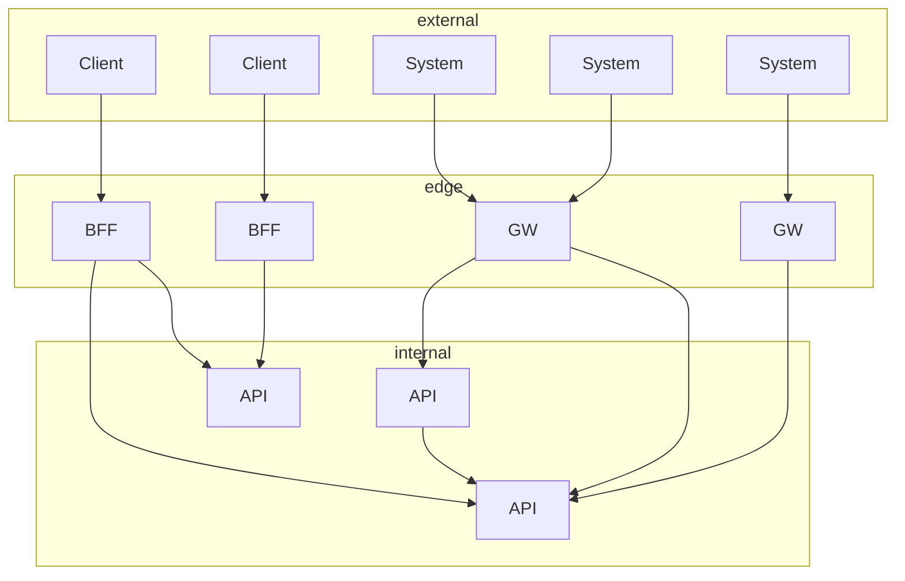
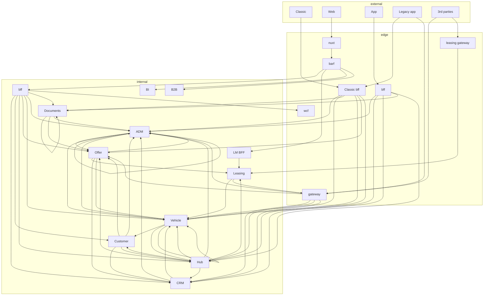
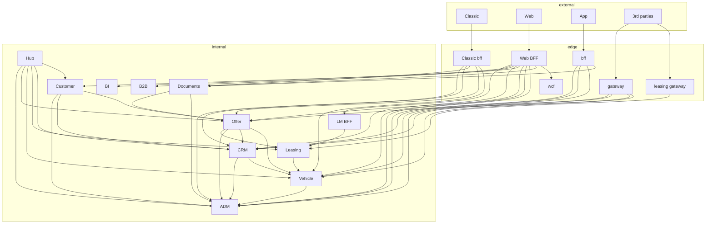

## Platformsarkitektur
### i AutoDesktop

---

## Nøglebegreber

- API'er <!-- .element: class="fragment" -->
- Gateways og BFF'er <!-- .element: class="fragment" -->
- Klienter <!-- .element: class="fragment" -->
- REST <!-- .element: class="fragment" -->
- OpenAPI <!-- .element: class="fragment" -->

---

## Platformsarkitektur


<!-- .element: class="fragment" -->

Dette er målet <!-- .element: class="fragment" -->

----

### Platformsarkitektur
## Vi er der ikke helt


<!-- .element: class="fragment" -->

----

### Platformsarkitektur
## Nedslag

- Leasing kalder gateway <!-- .element: class="fragment" -->
- Cykliske og ego reference <!-- .element: class="fragment" -->
- Distribueret BFF'er\* <!-- .element: class="fragment" -->
- Legacy app kalder både bff og gateway <!-- .element: class="fragment" -->
- Hubben bør drives af events <!-- .element: class="fragment" -->


<!-- .element: class="fragment" -->

---

## API'er

> Microservices der holder alt forretningslogik omkring et givent domæne.
<!-- .element: class="fragment" -->

- Er kun synligt på det interne netværk <!-- .element: class="fragment" -->
- Udstiller ikke intime deltaljer <!-- .element: class="fragment" -->
- Kan tilgås via REST <!-- .element: class="fragment" -->
- Dokumenteret med OpenAPI <!-- .element: class="fragment" -->
- Emitter events (TO-BE) <!-- .element: class="fragment" -->
- Håndterer sikkerhed (TO-BE) <!-- .element: class="fragment" -->
  - Især Authorization <!-- .element: class="fragment" -->
- Har sin egen database (TO-BE) <!-- .element: class="fragment" -->
- Kan skalere horizontal (TO-BE) <!-- .element: class="fragment" -->

---

## Gateways

> En ekstern indgang til vores api'er.
<!-- .element: class="fragment" -->

- Synligt på det eksterne netværk <!-- .element: class="fragment" -->
- Udstiller ikke intime deltaljer <!-- .element: class="fragment" -->
- Kan tilgås via REST <!-- .element: class="fragment" -->
- Dokumenteret med OpenAPI <!-- .element: class="fragment" -->
- Aggregerer data <!-- .element: class="fragment" -->
- Holder ikke forretningslogik <!-- .element: class="fragment" -->
- Håndterer sikkerhed (AS-IS) <!-- .element: class="fragment" -->
  - Især Authentication <!-- .element: class="fragment" -->

---

## BFF

> Backend For Frontend
<!-- .element: class="fragment" -->

- En gateway designet til præcis én front <!-- .element: class="fragment" -->
- Web BFF er distribueret <!-- .element: class="fragment" -->
  - Nuxt er indgangen <!-- .element: class="fragment" -->
  - BARF er authentication <!-- .element: class="fragment" -->
  - BFF er data aggregering <!-- .element: class="fragment" -->
  - Kunne godt samles i Nuxt på sigt <!-- .element: class="fragment" -->


---
## Klienter

- Classic og legacy app <!-- .element: class="fragment" -->
  - Winforms og Xamarin - C# <!-- .element: class="fragment" -->
- Web <!-- .element: class="fragment" -->
  - Vue og Nuxt - TypeScript <!-- .element: class="fragment" -->
- App <!-- .element: class="fragment" -->
  - Flutter - Dart <!-- .element: class="fragment" -->


Vi skal sørge for at vi undersøtter disse sprog 
<!-- .element: class="fragment" -->

f.eks. enums, undefined og unions
<!-- .element: class="fragment" -->

---

## REST
> REST defines 6 architectural constraints that make any web service – a truly RESTful API.  
> -- [restfulapi.net](https://restfulapi.net/)


1. Uniform interface <!-- .element: class="fragment" -->
2. Client-server <!-- .element: class="fragment" -->
3. Stateless <!-- .element: class="fragment" -->
4. Cacheable <!-- .element: class="fragment" -->
5. Layered system <!-- .element: class="fragment" -->
6. Code on demand (optional) <!-- .element: class="fragment" -->

REST som begreb er udvandet <!-- .element: class="fragment" -->

Note:
1. En api'er, HTTP og conventions
2. Afhængigheder
3. Ingen session state
4. Doh
5. Doh
6. Api'erne levere ikke kode


----

## Maturity Levels

By [Leonard Richardson](https://en.wikipedia.org/wiki/Richardson_Maturity_Model)

### Level 0
The Swamp of POX - et endpoint ❌ <!-- .element: class="fragment" -->

### Level 1
Resources - flere endpoints ✅ <!-- .element: class="fragment" -->

### Level 2
Methods - flere metoder ✅ <!-- .element: class="fragment" -->

### Level 3
Hypermedia Controls - links ❌ <!-- .element: class="fragment" -->


----

## Konventioner i AutoDesktop
<div class='r-stack'>

<div class='fragment fade-out' data-fragment-index="0">
  <h3>AS-IS</h3>
  <ul>
    <li>POST /Vehicle { data }</li>
    <li>GET /Vehicle/:id</li>
    <li>GET /VehicleCollection</li>
    <li>PUT /Vehicle/:id { data }</li>
    <li>DELETE /Vehicle/:id</li>
    <li>POST /Vehicle/:id/MarkAsSold { data }</li>
  </ul>
</div>


<div class='fragment' data-fragment-index="0">
<h3>TO-BE</h3>
  <ul>
    <li>POST /vehicles { data }</li>
    <li>GET /vehicles/:id</li>
    <li>GET /vehicles</li>
    <li>PUT /vehicles/:id { data }</li>
    <li>DELETE /vehicles/:id</li>
    <li>POST /vehicles/:id/mark-as-sold { data }</li>
  </ul>

  <p class='fragment'>
    Tænk på det som stier på din PC - et billede har en sti: C:\Users\aff\Pictures\IMG_20231206_165750.jpg
  </p>

</div>

<div>

----
## HTTP status koder

- 200 OK - GETs <!-- .element: class="fragment" -->
- 201 Created - POSTs <!-- .element: class="fragment" -->
- 204 No Content - PUTs, PATCHs, DELETEs <!-- .element: class="fragment" -->
- 400 Bad Request - Hvad siger du? <!-- .element: class="fragment" -->
- 401 Unauthorized - Hvem er du? <!-- .element: class="fragment" -->
- 403 Forbidden - Du må ikke! <!-- .element: class="fragment" -->
- 404 Not Found - Noget er ikke fundet, se næste slide <!-- .element: class="fragment" -->
- 409 Conflict - En domæneregel er ikke overholdt <!-- .element: class="fragment" -->
- 422 Unprocessable Content - Det du siger giver ikke mening! <!-- .element: class="fragment" -->
- 429 Too Many Requests - Slap af! <!-- .element: class="fragment" -->
- 500 Internal Server Error - Oops! <!-- .element: class="fragment" -->

----
## 404 Not Found

```http
POST /users/1337/friends
{
  "userId": 1442
}
```
- Hvis 1337 ikke findes?  
__404 Not Found__ <!-- .element: class="fragment" -->
- Hvis 1442 ikke findes?  
__422 Unprocessable Content__ <!-- .element: class="fragment" -->

> Indtil videre er vi pragmatiske og bruger __404__ hvis noget ikke kan findes
<!-- .element: class="fragment" -->
---

## OpenAPI

> En specifikation for et HTTP API

- Ofte synomym med Swagger <!-- .element: class="fragment" -->
  - SwaggerGen generere spec <!-- .element: class="fragment" -->
  - SwaggerUI rendere <!-- .element: class="fragment" -->
  - NSwag generere kode <!-- .element: class="fragment" -->
- Vi tester at spec'en ikke ændrer sig <!-- .element: class="fragment" -->
- API'erne genererer en nuget pakke med NSwag <!-- .element: class="fragment" -->

----

## Versionering

- Vi har version 1 af vores api'er <!-- .element: class="fragment" -->
- Breaking changes bør betyde ny version <!-- .element: class="fragment" -->
- Vi har ikke rammerne på plads for versionering <!-- .element: class="fragment" -->
- Breaking changes skal koordineres med hele huset <!-- .element: class="fragment" -->
- TO-BE: Versioner er aligned på tværs af api og nuget pakke <!-- .element: class="fragment" -->

> AS-IS: Undgå så vidt muligt breaking changes i api'erne.
<!-- .element: class="fragment" -->
---

## Review
### Opmærksomhedpunkter

- Afhængigheder? <!-- .element: class="fragment" -->
- Endpoints? <!-- .element: class="fragment" -->
- Er der breaking changes? <!-- .element: class="fragment" -->