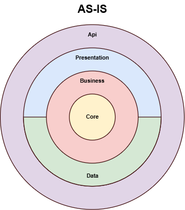
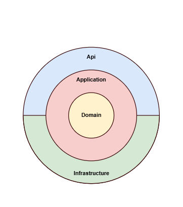

## Løsningsarkitektur
### i AutoDesktop

---

## Nøglebegreber

- Domain Driven Design <!-- .element: class="fragment" -->
- CQRS <!-- .element: class="fragment" -->
- Clean Architecture <!-- .element: class="fragment" -->

---

## Domain Driven Design

> The heart of software is its ability to solve domain-related problems for its user  
> -- Eric Evans

- Ubiquitous Language
- Bounded Contexts
- Core Domain Focus
- Rich Domain Models

----

### Domain Driven Design
## For udviklere

- Domæne modeller
  - Value Objects
  - Entities
  - Aggregates
  - Det dykker vi ned i anden gang
- Repositories og Unit Of Work
  - AKA Loaders
- Domain Services
- Domain og Integration Events
- Separation of Concerns
  - Microservices
  - Clean Architecture

----

### Domain Driven Design

## Repositories
> Læser og skriver domænemodeller fra databasen

## Unit Of Work
> Tracker ændringer, og committer transaktionelt

## Entity Framework
> Repository = DbSet  
> Unit of Work = EFCore

----
### DDD
## Domain services

Domæne logik der ikke hører til på en domæne model

- Beregninger 
- Involverer flere domæne modeller
- F.eks. berening af annonceret pris. Kræver
  - Køretøjet/annoncen
  - Leveringsomkostninger
  - Nummerpladeomkostninger

----
### Domain Driven Design
## Events (TO-BE)

- Emittes af Domæne Modellen
- Intent baseret
- Domæne events
  - Rich events
  - Aftages domænet
- Integration events
  - Slim events
  - Aftages af andre

Vi er kun lige startet

----
### Domain Driven Design
## Events, eksempel

TODO


---

## CQRS

> Command Query Responsibility Segregation (CQRS) is a design pattern that segregates read and write operations for a data store into separate data models. This approach allows each model to be optimized independently and can improve the performance, scalability, and security of an application.  
> -- [https://learn.microsoft.com/](https://learn.microsoft.com/en-us/azure/architecture/patterns/cqrs)

CQRS er først beskrevet af Greg Young i 2010
<!-- .element: class="fragment" -->

----

### CQRS
## Commands

> Commands should represent specific business tasks instead of low-level data updates. For example, in a hotel-booking app, use the command "Book hotel room" instead of "Set ReservationStatus to Reserved." This approach better captures the intent of the user and aligns commands with business processes.  
> -- [https://learn.microsoft.com/](https://learn.microsoft.com/en-us/azure/architecture/patterns/cqrs#solution)

Aligner ret godt med DDD
<!-- .element: class="fragment" -->

----

### CQRS
## Queries

> Queries never alter data. Instead, they return data transfer objects (DTOs) that present the required data in a convenient format, without any domain logic. This distinct separation of responsibilities simplifies the design and implementation of the system.  
> -- [https://learn.microsoft.com/](https://learn.microsoft.com/en-us/azure/architecture/patterns/cqrs#solution)

Aligner knapt så godt med DDD

---

## Clean architecture
### Og DDD
 <!-- .element: class="fragment" -->
 <!-- .element: class="fragment" -->

----

### Clean architecure
## Lag

- Domain: alt forretnings logik
- Application: CQRS
- Api: ASP.NET
- Infrastructure: Kommunikation med omverdenen


---

### Løsningsarkitektur
## Hands on


----

### Domæne modeller*

```c#
namespace Domain; 

public enum Title { Junior, Senior, Boss }

public class Employee {
  public required Name FirstName { get; set; }
  public required Name LastName { get; set; }

  public required Title Title { get; init; }
  public required Money Salary { get; init; }

  public void Promote(Title to) {
    if (to < Title) throw new Exception("This is not a promotion");
    Title = to;
    Salary *= 1.2;
  }
}
```

\* legetøjseksempel

----

### Command handlers
## CRUD
```c#
namespace Application;

public record UpdateEmployee(EmployeeId Id) {
  public Name? FirstName { get; init; }
  public Name? LastName { get; init; }
}

public class UpdateEmployeeHandler(IUnitOfWork uow) {
  public async Task Execute(UpdateEmployee command) {
    var employee = await uow.LoadAsync<Employee>(command.Id);
    
    if (command.FirstName is not null) employee.FirstName = command.FirstName;
    if (command.LastName is not null) employee.LastName = command.LastName;

    await uow.CommitAsync();
  }
}
```

----

### Command handlers
## With I/O
```c#
namespace Application;

public record UpdateEmployeeFromCpr(EmployeeId Id, string CprNumber);

public class UpdateEmployeeFromCprHandler(IUnitOfWork uow, ICprService service)
{
  public async Task Execute(UpdateEmployeeFromCpr command) {
    var cprResult = service.LookupAsync(command.CprNumber);

    var employee = await uow.LoadAsync<Employee>(command.Id);
    
    employee.FirstName = cprResult.FirstName;
    employee.LastName = cprResult.LastName;

    await uow.CommitAsync();
  }
}
```

----

### Command handlers
## Behavior
```c#
namespace Application;

public record PromoteEmployee(EmployeeId Id, Title To);

public class PromoteEmployeeHandler(IUnitOfWork uow) {
  public async Task Execute(PromoteEmployee command) {
    var employee = await uow.LoadAsync<Employee>(command.Id);
    
    employee.Promote(command.To);

    await uow.CommitAsync();
  }
}
```

----

## Query handlers

```c#
namespace Application;

public record GetEmployeesInCompany(CompanyId Id);

public class GetEmployeesInCompanyHandler(IEmployeesService service) {
  public Task<IReadonlyList<Employee>> Handle(GetEmployeesInCompany query) {
    return service.GetAllByCompanyIdAsync(query.Id);
  }
}
```

----

## Db Context

```c#
namespace Infrastructure.Data;

public class MyDbContext(DbContextOptions<MyDbContext> options)
  : DbContexts(options)
{
  protected override void OnModelCreating(ModelBuilder modelBuilder) {
    modelBuilder.ApplyConfigurationsFromAssembly(
      typeof(MyDbContext).Assembly
    );
  }
}

public class EmployeeConfiguration : IEntityTypeConfiguration<Employee> {
  public void Configure(EntityTypeBuilder<Employee> builder) {
    // configure how employees are mapped to db
  }
}
```

----

## Unit Of Work
### Experimental

```c#
namespace Infrastructure.Data;

public class UnitOfWork(MyDbContext context) : IUnitOfWork {
  public Task<T> LoadAsync<T>(Id<T> id) where T : AggregateRoot =>
    context.Set<T>().SingleAsync(x => x.Id == id);

  public Task CommitAsync() => context.SaveChangesAsync();
}
```

Måske den skal lægges i en delt pakke

----

## Employees Service

```c#
namespace Infrastructure.Data;

public class EmployeesService(MyDbContext context) : IEmployeesService {
  public Task<Employee[]> GetAllByCompanyIdAsync(CompanyId companyId)
  {
    return context.Set<Employee>()
      .Where(x => x.CompanyId == companyId)
      .ToListAsync();
  }
}
```

----

## Command Controller

<div class='r-stack'>

```c#
namespace Api;

public record UpdateEmployeeRequest(string? FirstName, string? LastName);

public class MyCommandController {

  [HttpPut("employees/{id}")]
  public async Task<ActionResult> UpdateEmployee(
    [FromRoute] string id,
    [FromBody] UpdateEmployeeRequest request 
  ) {
    
    await DispatchAsync(new UpdateEmployee(EmployeeId.Parse(id)) {
      FirstName = request.FirstName?.ToName(),
      LastName = request.LastName?.ToName(),
    });

    return NoContent();
  }
}
```
<!-- .element: class="current-visible" -->

```c#
namespace Api;

public record UpdateEmployeeRequest(Name? FirstName, Name? LastName);

public class MyCommandController {

  [HttpPut("employees/{id}")]
  public async Task<ActionResult> UpdateEmployee(
    [FromRoute] EmployeeId id,
    [FromBody] UpdateEmployeeRequest request 
  ) {
    
    await DispatchAsync(new UpdateEmployee(id) {
      FirstName = FirstName,
      LastName = LastName,
    });

    return NoContent();
  }
}
```
<!-- .element: class="fragment" -->

</div>

----

## Command Controller

```c#
namespace Api;

public record UpdateEmployeeFromCprRequest(string CprNumber);

public class MyCommandController {

  [HttpPost("employees/{id}/update-from-cpr")]
  public async Task<ActionResult> UpdateEmployee(
    [FromRoute] EmployeeId id,
    [FromBody] UpdateEmployeeFromCprRequest request 
  ) {
    await DispatchAsync(new UpdateEmployeeFromCpr(id, request.CprNumber));

    return NoContent();
  }
}
```

----

## Command Controller

```c#
namespace Api;

public record PromoteEmployeeRequest(Title To);

public class MyCommandController {

  [HttpPost("employees/{id}/promote")]
  public async Task<ActionResult> UpdateEmployee(
    [FromRoute] EmployeeId id,
    [FromBody] PromoteEmployeeRequest request 
  ) {
    await DispatchAsync(new PromoteEmployee(id, request.To));

    return NoContent();
  }
}
```

----

## Query Controller

```c#
namespace Api;

public record EmployeesResponse(IReadOnlyList<Employee> Employees);

public class MyCommandController {
  [HttpGet("companies/:id/employees")]
  public async Task<ActionResult<EmployeesResponse>> GetEmployees(
    [FromRoute] CompanyId id
  ) {
    var employees = await DispatchAsync<>(new GetEmployeesInCompany(id));

    return Ok(new EmployeesResponse(employees));
  }
}
```

---

## Recap
- Beskriv domæne modeller vha DDD
  - Alle skrivninger går gennem domæne modeller
- Infrastucture persisterer domæne modeller
- Infrastucture implementerer services til queries
- Application består af Commands and Queries
- Command handlers arbejder på én domæne model
- Query handlers er stort set kun videre stilling
- Api er bindingen til REST/HTTP