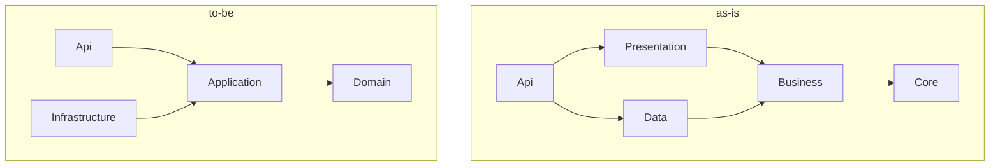

## Løsningsarkitektur
### i AutoDesktop

---

## Formål
> Vi vil gerne højne kvaliteten af vores kode og reviews. Det kræver at vi er alignet omkring vores arkiktur.
<!-- .element: class="fragment" -->

---

## Nøglebegreber

- Platformsarkitektur <!-- .element: class="fragment" -->
  - API'er <!-- .element: class="fragment" -->
  - Gateways og BFF'er <!-- .element: class="fragment" -->
  - Klienter <!-- .element: class="fragment" -->
  - REST <!-- .element: class="fragment" -->
- Løsningsarkitektur <!-- .element: class="fragment" -->
  - CQRS <!-- .element: class="fragment" -->
  - Domain Driven Design <!-- .element: class="fragment" -->
  - Clean Architecture <!-- .element: class="fragment" -->
- Kodeteknik <!-- .element: class="fragment" -->
  - Result\<T\> <!-- .element: class="fragment" -->
  - async/await <!-- .element: class="fragment" -->
  - IoC <!-- .element: class="fragment" -->
  - Testing <!-- .element: class="fragment" -->
  - Og sikker mere! <!-- .element: class="fragment" -->

---

## Clean architecure

---

## CQRS

Vil vi, og hvad hører til hvor?  
Uanset er tanker bag fine:  
Commands arbejder på aggregate roots  
Queries arbejder på hvad der giver bedst performance

---

## DDD

Aggregate roots, repositories, domain events

- Loaders = Repositories

---

## Clean architecture

Cleanish vs clean

---

## Result???

Ikke en erstatning til exceptions!  
status 4xx = result  
status 5xx = exception  
Nye konstruktioner (Amalie)

---
