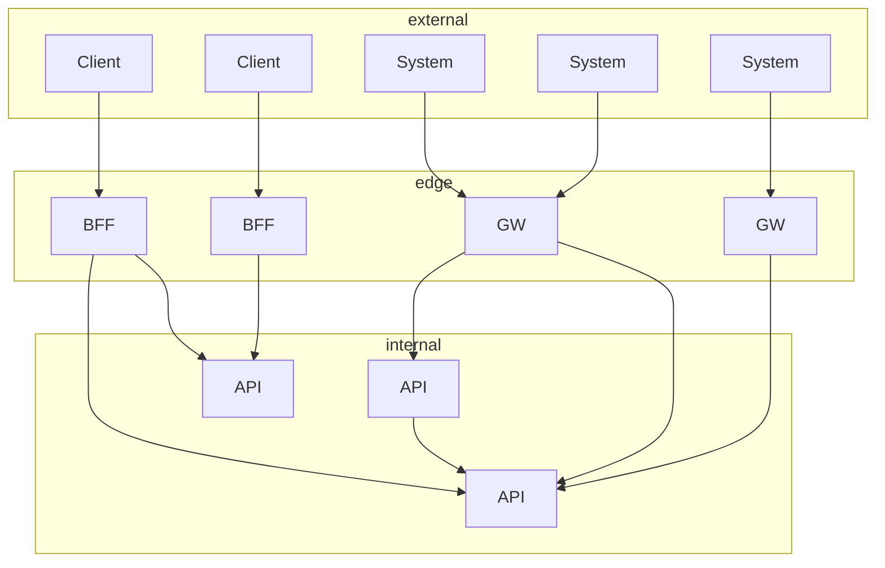
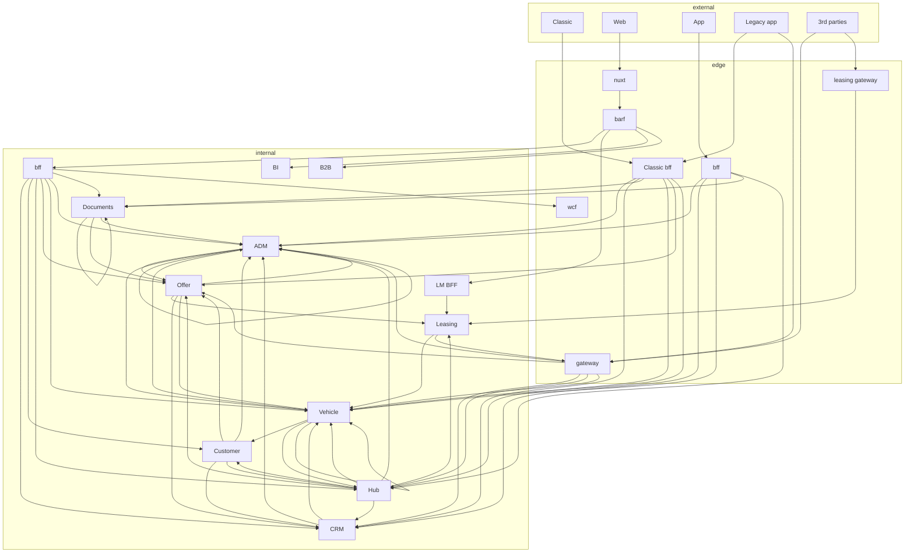
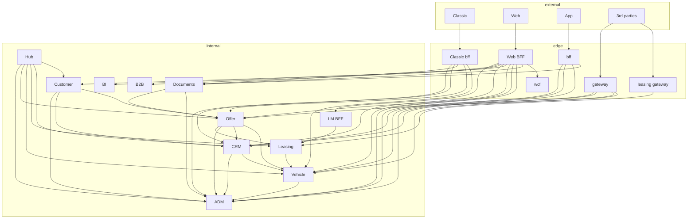

# Arkitektur
## i AutoDesktop

---

## Formål
> Vi vil gerne højne kvaliteten af vores kode og reviews. Det kræver at vi er alignet omkring vores arkiktur.
<!-- .element: class="fragment" -->

---

## Nøglebegreber

- Platformsarkitektur
  - API'er <!-- .element: class="fragment" -->
  - Gateways og BFF'er <!-- .element: class="fragment" -->
  - Klienter <!-- .element: class="fragment" -->
  - REST <!-- .element: class="fragment" -->

- Løsningsarkitektur
  - CQRS <!-- .element: class="fragment" -->
  - Domain Driven Design <!-- .element: class="fragment" -->
  - Clean Architecture <!-- .element: class="fragment" -->

- Kodeteknik
  - Result\<T\> <!-- .element: class="fragment" -->
  - Og sikker mere! <!-- .element: class="fragment" -->

---

## Platformsarkitektur

<!-- .element: class="fragment" -->

Dette er målet <!-- .element: class="fragment" -->

----

### Platformsarkitektur
## Vi er der ikke helt

<!-- .element: class="fragment" -->

----

### Platformsarkitektur
## Nedslag

- Leasing kalder gateway <!-- .element: class="fragment" -->
- Cyliske og ego reference <!-- .element: class="fragment" -->
- Distribueret BFF'er\* <!-- .element: class="fragment" -->
- Legacy app kalder både bff og gateway <!-- .element: class="fragment" -->
- Hubben bør drevet af events <!-- .element: class="fragment" -->

<!-- .element: class="fragment" -->

---

## API'er

> Micro services der holder alt forretningslogik omkring et givent domæne.
<!-- .element: class="fragment" -->

- Er kun synligt på det interne netværk <!-- .element: class="fragment" -->
- Udstiller ikke intime deltaljer <!-- .element: class="fragment" -->
- Kan tilgås via REST <!-- .element: class="fragment" -->
- Dokumenteret med OpenAPI <!-- .element: class="fragment" -->
- Emitter events (TO-BE) <!-- .element: class="fragment" -->
- Håndterer sikkerhed (TO-BE) <!-- .element: class="fragment" -->
  - Især Authorization <!-- .element: class="fragment" -->
- Har sin egen database (TO-BE) <!-- .element: class="fragment" -->
- Kan skalere horizontal (TO-BE) <!-- .element: class="fragment" -->

---

## Gateways

> En ekstern indgang til vores api'er.
<!-- .element: class="fragment" -->

- Synligt på det eksterne netværk <!-- .element: class="fragment" -->
- Udstiller ikke intime deltaljer <!-- .element: class="fragment" -->
- Kan tilgås via REST <!-- .element: class="fragment" -->
- Dokumenteret med OpenAPI <!-- .element: class="fragment" -->
- Aggregerer data <!-- .element: class="fragment" -->
- Holder ikke forretningslogik <!-- .element: class="fragment" -->
- Håndterer sikkerhed (AS-IS) <!-- .element: class="fragment" -->
  - Især Authentication <!-- .element: class="fragment" -->

---

## BFF

> Backend For Frontend
<!-- .element: class="fragment" -->

- En gateway designet til præcis én front <!-- .element: class="fragment" -->
- Web BFF er distribueret <!-- .element: class="fragment" -->
  - Nuxt er indgangen <!-- .element: class="fragment" -->
  - BARF er authentication <!-- .element: class="fragment" -->
  - BFF er data aggregering <!-- .element: class="fragment" -->
  - Kunne godt samles i Nuxt på sigt <!-- .element: class="fragment" -->

---

## REST

Er blevet synonym med et http api.  
Noget med [4 Maturity Levels of REST API Design](https://blog.restcase.com/4-maturity-levels-of-rest-api-design/)  
Level 0 - The Swamp of POX  
Level 1 - Resources  
Level 2 - Methods  
Level 3 - Hypermedia Controls

Breaking changes er et no go AS-IS

TO-BE er versionering og sunsetting

---

## CQRS

Vil vi, og hvad hører til hvor?  
Uanset er tanker bag fine:  
Commands arbejder på aggregate roots  
Queries arbejder på hvad der giver bedst performance

---

## DDD

Aggregate roots, repositories, domain events

- Loaders = Repositories

---

## Clean architecture

Cleanish vs clean

---

## Result???

Ikke en erstatning til exceptions!  
status 4xx = result  
status 5xx = exception  
Nye konstruktioner (Amalie)

---

## Det gode review

Konkret kode - fint, men ofte nit?  
Overstående rammer  
MoSCoW?  
Tidshorizont?  
Pair programming?  