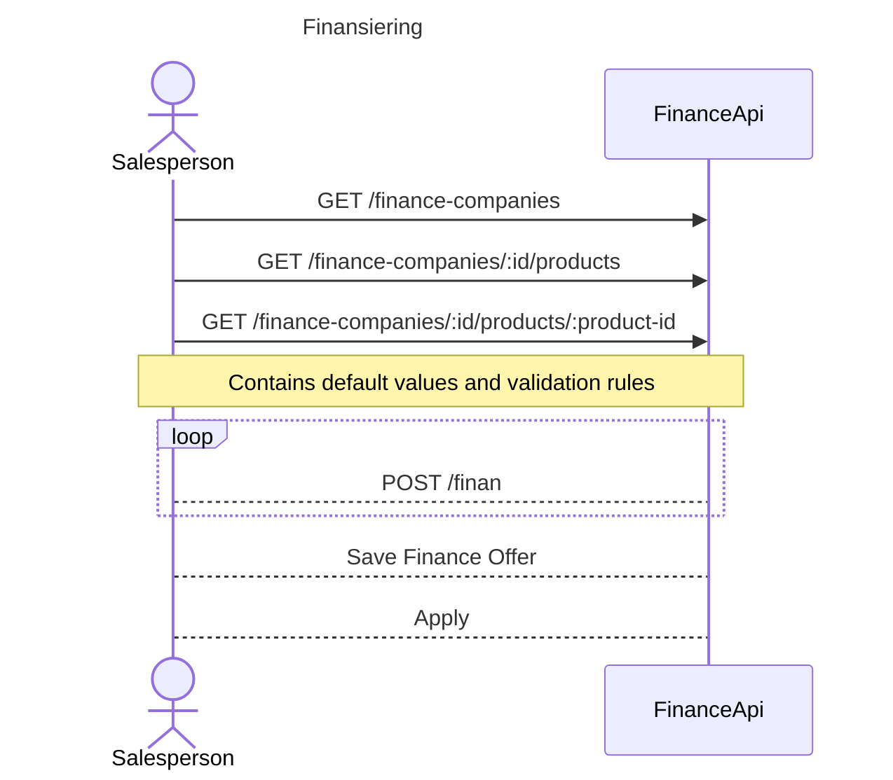

## Financing API
### Lån

----

## Flow

```mermaid
sequenceDiagram
  title Finansiering
  actor Salesperson
  participant FinanceApi

  Salesperson ->> FinanceApi: GET /finance-companies

  Salesperson ->> FinanceApi: GET /finance-companies/:id/products

  Salesperson ->> FinanceApi: GET /finance-companies/:id/products/:product-id
  note over Salesperson, FinanceApi: Contains default values and validation rules

  loop
  Salesperson --> FinanceApi: POST /finan
  end

  Salesperson --> FinanceApi: Save Finance Offer
  
  Salesperson --> FinanceApi: Apply
```

